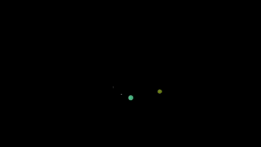

# Physics Simulator
> C++ Physics Renderer for electromagnetic and gravitational particle interactions

## 🧐 About 
This project is a 3D renderer built using the SDL2 Library in C++. The objects placed within this renderer have physical properties and interactions. Static fields can also be imported into the scene for more complex interactions. A *scene.json* file must included in the command line to provide instructions on how to generate the scene.

## 🛠 Setup
Step‑by‑step instructions:

```C
// CMakeLists.txt
// Set paths to reflect locations on your machine
set(SDL2_DIR "<PATH_TO_CMAKE_SDL2>")
set(SDL2_DLL "<PATH_TO_SDL2_DLL>")
```

```bash
# Terminal
# Create build environment
mkdir build
cd build
cmake ..
cmake --build . --config Debug
```

## 💬 Usage
```bash
# Terminal
# Execute program
cd build
./Debug/EMsim.exe ../scenes/<Your JSON>
```

[Link to Example Scene.json](https://github.com/TWilliamsA7/EMsim/blob/main/scenes/coloumb.json)

## 💫 Demo



## ▶ Features
- **Define Scene Via JSON {}** 
    - Following the provided format, any number of scenes can be generated quickly without having to touch the  code
- **Full Range Motion Customizable Camera** 🎥
    - Customize speed, FOV, and the window using the scene.json file
- **Coulomb Force and Gravitational Force** 📍
    - Define the mass and charge carried by objects and they will interact with each other through these forces
- **Electromagnetic Fields**
    - Based on particle state and field direction, fields can be defined which also impact particle moetion

## :phone: Contact
Tai Williams - twilliamsa776@gmail.com
https://github.com/TWilliamsA7/EMsim/tree/main
